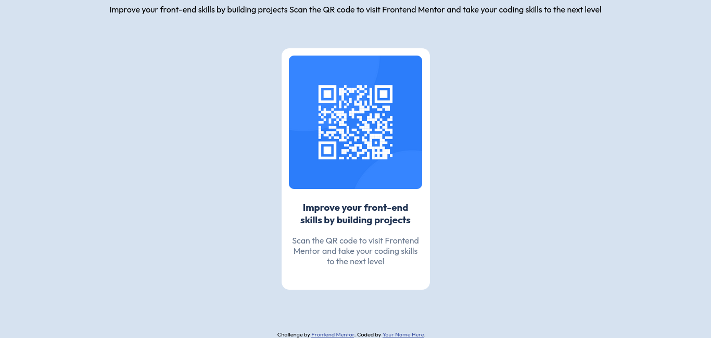

# Frontend Mentor - QR code component solution

This is a solution to the [QR code component challenge on Frontend Mentor](https://www.frontendmentor.io/challenges/qr-code-component-iux_sIO_H). Frontend Mentor challenges help you improve your coding skills by building realistic projects. 

## Table of contents

- [Overview](#overview)
  - [Screenshot](#screenshot)
  - [Links](#links)
  - [Built with](#built-with)
  - [What I learned](#what-i-learned)
  - [Continued development](#continued-development)
  - [Useful resources](#useful-resources)
- [Author](#author)

## Overview
A basic page with QR code to enter the Frontend Mentor for developing your coding skills
### Screenshot
  
### Links

- Solution URL:(https://rankobinu.github.io/My-first-project-QR-code/)
- Live Site URL:(https://rankobinu.github.io/My-first-project-QR-code/)
### Built with

- Semantic HTML5 markup
- CSS custom properties
- Flexbox
- CSS Grid
### What I learned
I havw learned learn from this challenge:
  -How to search for the information
  -How to use Git and GitHub
  -Padding,position,margin and border

### Continued development
Well this is my first full self madded by me using HTML,CSS so im still not comfortoble with them yet. therfore my focus rigt now is to practice more by building moreprojects.

### Useful resources

- [ChatGPT](https://www.chatgpt.com) - =Who doesn't kow about it but it's one of the greatest tools to use for coding.
- [YouTube](https://www.youtube.com) - there are many channels that helped me to acheive the challenge as BroCode and there are many channels.
- [Google Fonts](https://fonts.google.com) - it's a great if not the best for finding fonts

## Author
- Frontend Mentor - [@rankobinu](https://www.frontendmentor.io/profile/rankobinu)
